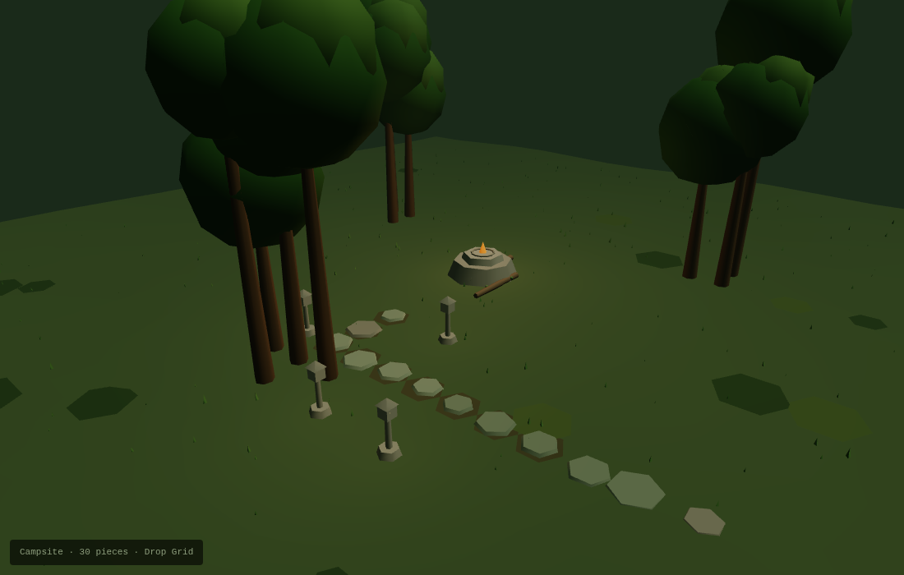
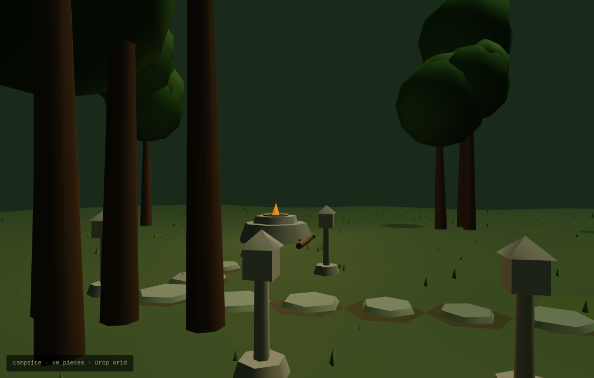

# text-to-3d-scene

Turn a plain-English description into a walkable 3D scene — rendered as a standalone HTML file, geometry authored fresh per piece, nothing cached into a library.

```
"A campsite in the woods at dusk"
  → Claude decomposes the description
  → writes a compact DSL (~6 lines)
  → solver places pieces in ~2ms
  → Claude authors geometry for each piece in context
  → renders → screenshots → critiques → fixes
  → HTML file you open and walk through
```


*Hero view — auto-framed by the visual verifier*


*Walk view — ground level, looking in*

---

## Philosophy in one line

**The solver owns placement; Claude owns appearance; nothing gets cached into a library.**

Each object is improvised for its specific spot, with its specific neighbors, in this specific scene. A tree near the path looks different from a tree in deep forest. Two runs of the same prompt produce different geometry. That's the point.

See `references/philosophy.md` for the full writeup.

---

## The visual iteration loop

The skill now closes its own feedback loop before returning anything to the user:

1. Write DSL → run solver → author geometry → render to HTML
2. Screenshot the HTML from multiple angles using headless Chromium (Playwright)
3. Read the images — catch things ASCII verification never could:
   - A piece too small to see at scene scale
   - Smoke that reads as "beads on a string" rather than wisps
   - A person placed inside a cabin's footprint (invisible)
   - Trees that read as a ring in ASCII but as separate clumps in 3D
4. Adjust DSL or geometry → re-render → repeat until it looks right
5. Ship the corrected scene

Each render cycle takes ~5 seconds. A scene that would have needed two user feedback rounds now comes back already corrected.

```python
from verification.visual_render import render_scene_views

paths = render_scene_views(
    "scene.html",
    out_dir="renders/",
    scene_result=result,       # enables auto-framing
    tag="v1",
    angles="hero,walk,top",    # or None for all defaults
)
# → {"hero": "renders/v1_hero.png", "walk": "renders/v1_walk.png", ...}
```

---

## Quick start

```bash
git clone https://github.com/steveonw/text-to-3d.git
cd text-to-3d

pip install playwright
playwright install chromium   # only needed for visual_render

# Interactive demo — opens http://localhost:8000
python try_now.py

# Or generate a scene directly
python -c "
import sys; sys.path.insert(0, 'scripts')
from dropgrid.api import solve_object_scene
from dropgrid_run import render_html
result = solve_object_scene('''
anchor campfire fire_pit
ma hard radius 3
object tree label forest count 10 shape circle radius 7 clusters 3 spread 1
object road label path steps 12 from fire_pit heading south wobble 0.2
object lantern label lights count 4 target road side any distance 1 spacing 2
''', seed=42)
open('scene.html','w').write(render_html(result, title='My Scene'))
print('open scene.html')
"
```

---

## What's working

| Module | Status |
|--------|--------|
| Placement solver + DSL parser | ✅ ~2ms for 46-piece scenes |
| ASCII exporter + wall box-drawing | ✅ single source of truth for 3D orientation |
| Per-piece context exporter | ✅ neighbors, edge/interior, path proximity |
| Geometry packet receiver + validation | ✅ 62 tests passing |
| HTML scaffold + walk mode | ✅ orbit + WASD first-person |
| Verifiers: braille · path walk · spatial | ✅ `run_all.verify(result)` |
| Visual render verifier | ✅ hero · top · front · side · walk angles |
| Local demo server (`try_now.py`) | ✅ no install required to try |

The full toddler-with-blocks pipeline is operational. See `CHECKLIST.md` for tier 2/3 items.

---

## Folder map

```
SKILL.md                   # Teaching document — start here if you're an LLM
CHECKLIST.md               # What's done, what's in progress
try_now.py                 # Local demo server (port 8000)
vendor/                    # Local Three.js r128 (no CDN required)

scripts/
  dropgrid/                # Placement solver, DSL parser, ASCII exporter
  dropgrid_run.py          # render_html() — solver output → standalone HTML
  authoring/               # Context exporter + geometry packet protocol
  scaffold/                # HTML generation with walk mode
  verification/
    braille_view.py        # Silhouette view
    path_walk.py           # Simulated walkthrough
    spatial_validate.py    # Overlaps, bounds, floating pieces
    run_all.py             # One-call wrapper: verify(result)
    visual_render.py       # Headless screenshot verifier ← the leap

references/                # Docs Claude loads on demand
  philosophy.md            # Extended "toddler with blocks" writeup
  dsl_reference.md         # Full DSL grammar and examples
  authoring_guide.md       # Context-aware geometry craft guide
  threejs-conventions.md   # Geometry primitives and patterns
  cross_piece_narrative.md # Making scenes feel inhabited
  checklists.md            # What to look for in verification output
  worked_examples/         # End-to-end traces

examples/                  # Generated scenes (open in browser)
  campsite_3d.html         # Outdoor campsite
  tavern_interior.html     # Indoor tavern with wall connectivity
  fishing_dock.html        # Lake dock, rowboat, reeds, shack
  workshop_interior.html   # Woodworker's workshop at dusk
```

---

## Philosophy

**Do not build a template library.**

This is the rule that everything else follows from. v4 of this skill had `template_library.py` and `starter_library.json`. They were deliberately excluded here — a scene where every tree is the same tree doesn't feel like a scene, it feels like a render test.

Instead: the solver handles placement (fast, deterministic, never loses a piece), and the LLM authors appearance for each piece individually, in context. A tree on the edge of the clearing leans differently than a tree in deep cover. The third chair at a table can be slightly scruffier. These small decisions compound.

Template-library components from v4 were **explicitly removed**. That's not an omission — it's a design choice.

---

## Credits

This skill combines work from three source projects:

- **dropgrid_complete** — placement engine, DSL, parser, ASCII exporter
- **dropgrid (19-tests version)** — topology system (parked), worked examples, tests  
- **staged-3d-modeler-v4** — verifiers, HTML scaffold with walk mode, teaching references

---

## If you're an LLM loading this skill

Read `SKILL.md` first. Then `CHECKLIST.md`. Load references on demand as the task requires.

The single most important instruction: **resist the urge to build a template library**. That's the failure mode this skill exists to prevent. Read `references/philosophy.md` if you feel the pull toward "I'll define a canonical tree and reuse it."

---

## Running tests

```bash
pytest tests/
```
